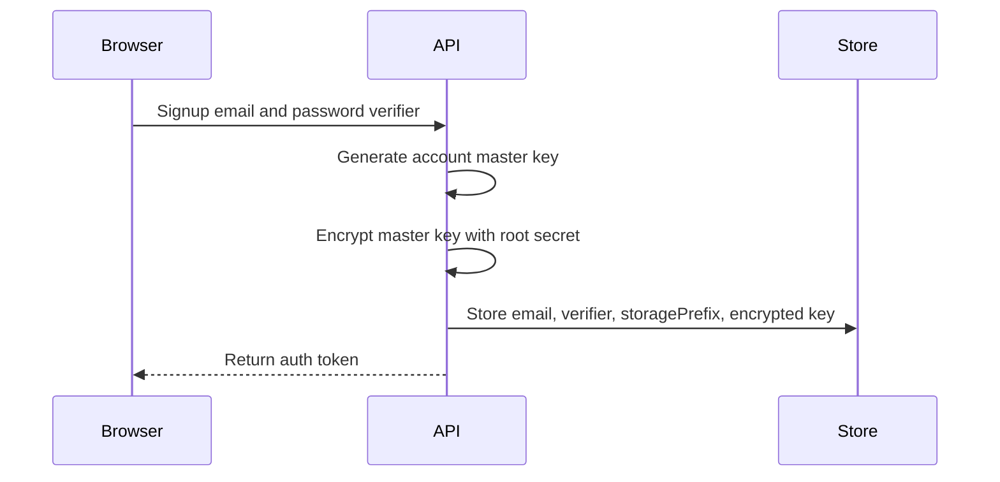
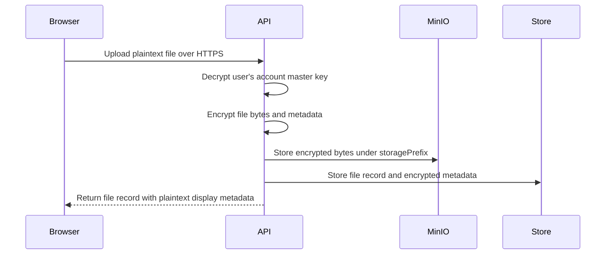
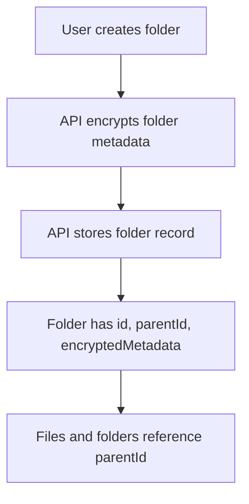
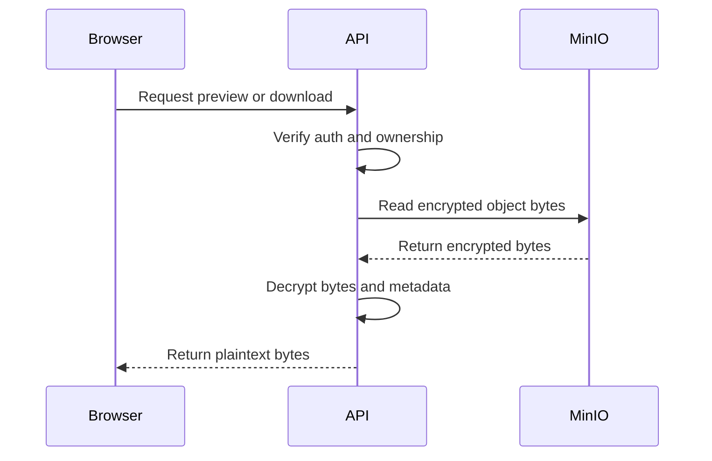
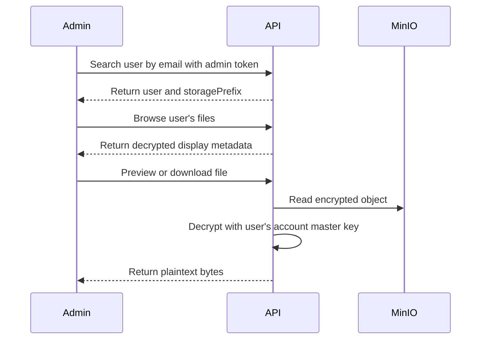

# Storage and Encryption Flow

This document explains how Frorage stores files, folders, metadata, and server-side recovery material after the server-managed encryption pivot.

## Definitions

- **Browser**: The Frorage web app running on the user's machine. It uploads plaintext over HTTPS and receives plaintext previews/downloads from the API.
- **API**: The trusted Frorage backend. It owns account keys, encrypts/decrypts files, and talks to MinIO/S3.
- **MinIO/S3**: Object storage. It stores encrypted file bytes only.
- **Account master key**: A random per-user secret created by the API at signup. It encrypts that user's files and metadata.
- **Root encryption secret**: Server/admin secret configured as `MASTER_KEY_ENCRYPTION_SECRET`. It encrypts account master keys at rest.
- **Storage prefix**: Server-known bucket prefix for a user, such as `users/user_abc`. It maps email/user id to object storage.
- **Plaintext**: Readable original data, such as a filename or file bytes.
- **Ciphertext**: Encrypted data stored in MinIO/S3 or metadata records.
- **Admin token**: Secret bearer token used for admin recovery APIs.

## Core Idea

Frorage is now server-managed encrypted storage.

- The browser does not hold file encryption keys.
- The API encrypts before storing bytes in MinIO/S3.
- The API decrypts for authenticated preview/download.
- Admin recovery is required for all users and is handled by server-side key custody.

## Signup and Key Setup

Users do not receive a recovery phrase, recovery file, or account master key.

## Upload Flow

Object keys are intentionally server-owned:

Example: `frorage/users/<user-id>/objects/<object-id>`

The bucket does not mirror the visible folder tree. Folders are metadata records.

## Folder Flow

Moving a file or folder changes only the record's `parentId`. The encrypted object bytes usually stay under the same object key.

## Preview and Download Flow

The browser renders supported previews for images, videos, and PDFs. Other file types remain download-only.

## Admin Recovery Flow

Admin recovery is a product feature, not a hidden zero-knowledge bypass. Frorage operators with valid admin credentials can recover user files.

## Persistence Requirement

The current MVP in-memory API repository is not durable. If the API process restarts, user/account/file metadata is lost even if encrypted blobs still exist in MinIO.

Durable metadata must include:

- users and email-to-user id mapping;
- password verifier;
- storage prefix;
- encrypted account master key and nonce;
- file/folder records;
- parent folder relationships;
- encrypted metadata;
- object keys;
- usage events and password reset records.
