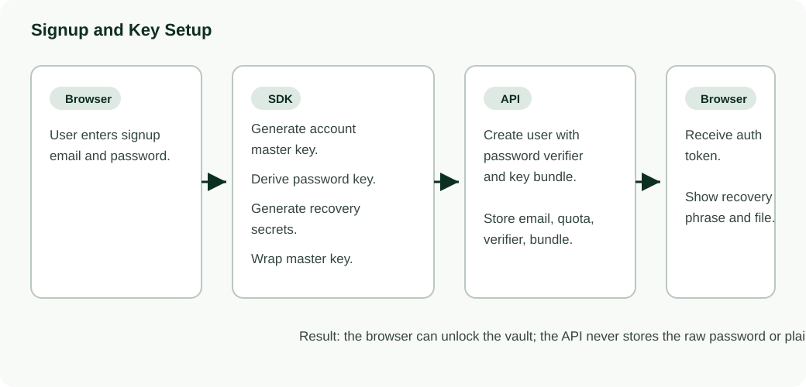
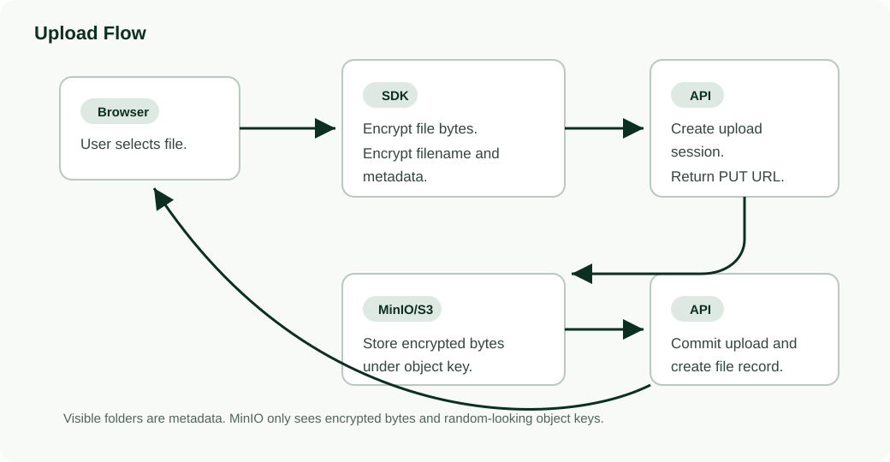
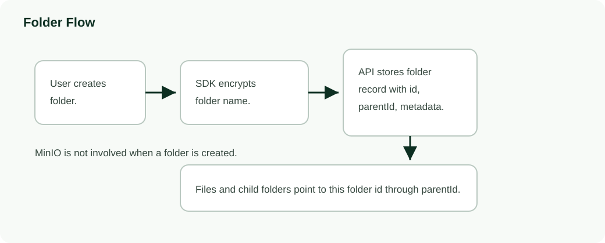
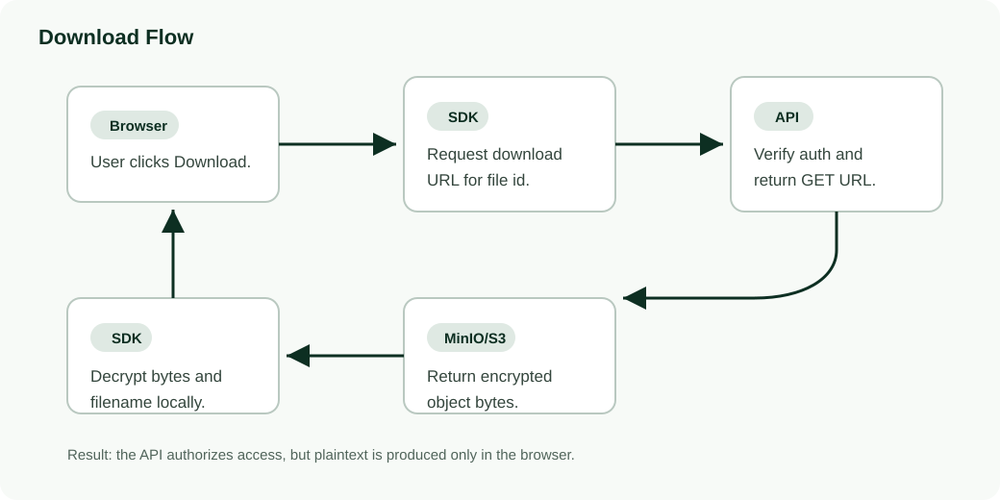

# Storage and Encryption Flow

This document explains how Frorage stores files, folders, encrypted metadata, and recovery material.

## Definitions

- **Browser**: The Frorage web app running on the user's machine.
- **SDK**: The TypeScript package used by the web app for auth, encryption, upload, download, and recovery logic.
- **API**: The Frorage backend. It stores account/file/folder records and asks MinIO for temporary upload/download links.
- **MinIO/S3**: The object storage service. It stores encrypted file bytes, but does not understand Frorage folders or filenames.
- **Object bytes**: The actual uploaded file contents after encryption. For example, the encrypted bytes of `resume.pdf`.
- **Object key**: The storage path MinIO uses for encrypted bytes, such as `users/<user-id>/objects/<object-id>`. It is intentionally random-looking and does not reveal the filename.
- **Vault metadata**: Records that describe the vault, such as users, files, folders, parent folder relationships, encrypted filenames, object keys, and quotas.
- **Plaintext**: Original readable data before encryption, such as the real filename or the original file bytes.
- **Ciphertext**: Encrypted data. MinIO stores ciphertext, not plaintext.
- **Account master key**: A random secret created during signup. It encrypts and decrypts the user's file bytes and metadata.
- **Password key**: A key derived from the user's password. It is used to unlock the account master key, not to encrypt every file directly.
- **Password verifier**: Data the API can use to check whether a login password is correct without storing the raw password.
- **Key bundle**: Encrypted recovery/login material stored by the API. It lets the browser unlock the account master key after login or recovery, but it is not useful by itself without the password or recovery secret.
- **Recovery phrase secret**: Secret material represented by the recovery phrase. It can help unlock the account master key if the password is lost.
- **Recovery file secret**: Secret material saved inside the recovery file. It must be paired with the stored key bundle to recover access.
- **Auth token**: A temporary login token returned by the API after signup/login. The browser sends it with later API requests to prove the user is signed in.
- **Quota**: The account's storage limit and usage accounting.
- **Presigned URL**: A temporary MinIO/S3 link created by the API so the browser can upload or download encrypted bytes directly.

## Core Idea

Frorage separates **object bytes** from **vault metadata**.

- MinIO/S3 stores encrypted object bytes under opaque object keys.
- The API stores account records, key bundles, file records, folder records, object-key mappings, and encrypted metadata.
- The browser/SDK owns encryption and decryption. The API never receives plaintext file bytes, filenames, folder names, or the account master key.

## Signup and Key Setup

The recovery file does **not** contain the account master key directly. It contains a recovery secret that can unwrap the master key only when paired with the stored key bundle.

## Upload Flow

Object keys are intentionally opaque:

Example: `frorage/users/<user-id>/objects/<object-id>`

The bucket does not mirror the visible folder tree. A file shown as:

Example visible path: `Vault / Taxes / 2026 / return.pdf`

still lives in the bucket as something like:

Example bucket object key: `users/user_qKG.../objects/obj_07Q...`

## Folder Flow

Folders are API metadata records, not MinIO folders.

Moving a file or folder changes only the record's `parentId`. The encrypted object bytes usually stay under the same object key.

## Download Flow

The API authorizes the download, but the browser performs decryption.

## Copy and Move

Move is metadata-only. The app updates the file record with `PATCH /v1/files/{fileId}` and sets `parentId` to the destination folder id.

Copy is currently client-driven:

1. Download encrypted object through the normal download flow.
2. Decrypt bytes in the browser.
3. Re-encrypt/upload as a new object.
4. Commit a new file record in the destination folder.

If the client disconnects during copy, the original remains safe, but the copy may be partial or absent. A future server-side encrypted-blob copy can make same-account copies more robust without exposing plaintext to the API.

## Recovery File Limits

Recovery protects against password loss, not metadata loss.

Recovery works when the API still has:

- the user record;
- the user's key bundle;
- the file/folder records;
- encrypted metadata;
- object-key mappings.

Recovery does **not** work if the API metadata is lost and only MinIO objects remain. The recovery file alone cannot identify which bucket prefix belongs to an email, cannot rebuild the key bundle, and cannot reconstruct filenames or folder structure.

## Metadata Persistence Requirement

The current MVP in-memory API repository is not durable. If the API process restarts, user/account/file metadata is lost even if encrypted blobs still exist in MinIO.

To make local development durable, add a persistent repository such as SQLite. For production, use the existing Postgres schema target.

Durable metadata must include:

- users and email-to-user id mapping;
- password verifier;
- key bundle;
- file/folder records;
- parent folder relationships;
- encrypted metadata;
- object keys;
- upload sessions and usage events.
